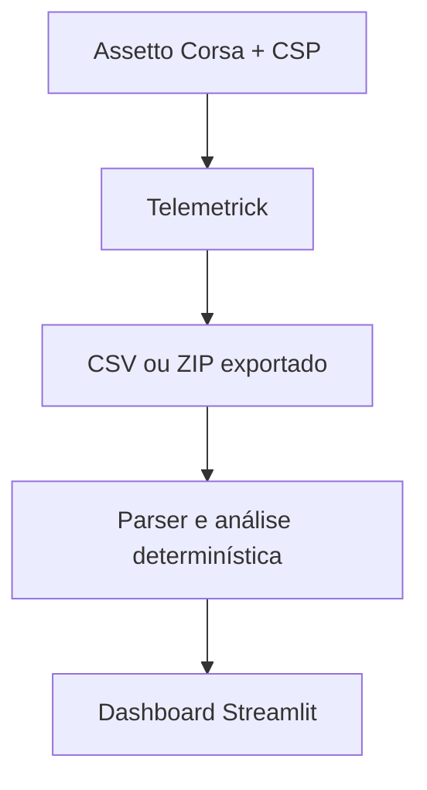

# FA26 Telemetry Engineer

Analisador local e determinístico de telemetria para o VRC Formula Alpha 2026 no
Assetto Corsa. A primeira versão transforma exports do Telemetrick em comparação de
voltas, leitura de energia e diagnósticos objetivos — sem depender de IA ou serviços
externos.

> Estado estável: **v0.0.1 — protótipo funcional de análise pós-sessão**
>
> Em `dev`: **v0.1.0-dev — parser de setup e mapa de deploy ao vivo**

## Por que este projeto existe

Um tempo de volta, sozinho, não explica se a diferença veio do piloto, da aerodinâmica,
dos pneus ou do mapa de energia. Este projeto começa separando esses sinais e evoluirá
para um engenheiro de setup que lê, valida e propõe mapas de ERS por regras explícitas.

## O que a v0.0.1 entrega

- Detecta automaticamente a pasta de exports do Telemetrick no Windows.
- Importa arquivos `.csv` e `.zip` manualmente como alternativa.
- Compara várias sessões e permite identificá-las como `Puro`, `Galeria` ou `ERS isolado`.
- Detecta voltas completas, válidas e invalidadas.
- Calcula melhor volta, mediana, velocidade máxima e consumo de combustível.
- Analisa SoC, deploy, regeneração, clipping e super-clipping quando os canais existem.
- Mostra delta acumulado e velocidade por distância entre duas voltas.
- Continua com análise parcial quando canais estendidos do VRC não foram exportados.
- Exporta um resumo comparativo em CSV.

## Início rápido no Windows

Pré-requisito: Python 3.11 ou superior.

1. Extraia o ZIP do projeto.
2. Execute `run_windows.bat`.
3. Aguarde o navegador abrir.
4. Confirme a pasta detectada e selecione as sessões.

Na primeira execução, o script cria `.venv` e instala as dependências. Também é possível
iniciar manualmente:

```powershell
py -3 -m venv .venv
.venv\Scripts\activate
python -m pip install -r requirements.txt
python -m streamlit run app.py
```

O caminho automático esperado segue este padrão:

```text
Documents\Assetto Corsa\apps\telemetrick\exported\<piloto>\<carro>\<pista>
```

Se ele não for encontrado, escolha **Upload manual** e envie o CSV ou ZIP.

## Arquitetura atual



O projeto usa os arquivos que o Telemetrick já exporta e não modifica nem redistribui seu
código. Veja [ARCHITECTURE.md](ARCHITECTURE.md) para as decisões de integração.

## Mapa ao vivo em desenvolvimento

A branch `dev` inclui um app Lua read-only para CSP. Ele desenha a pista diretamente da
spline do Assetto Corsa, acompanha o carro e lê o setup atual pelos IDs semânticos expostos
pelo carro. Não há dependência de imagens do MapDisplay nem redistribuição de código VRC.

Para instalar a cópia de desenvolvimento:

```powershell
.\scripts\install_ac_app.ps1
```

Os detalhes, o roteiro de validação e os limites atuais estão em
[docs/LIVE_APP.md](docs/LIVE_APP.md).

## Princípio determinístico

Métricas, validações e futuras alterações de setup devem ser reproduzíveis. A camada
determinística será responsável por interpretar parâmetros, calcular janelas por distância,
detectar conflitos e escrever uma cópia do setup. Uma camada de IA poderá explicar o
resultado em linguagem natural, mas não será a fonte dos cálculos nem editará arquivos sem
confirmação.

## Roadmap

- **0.0.x:** estabilizar importação, métricas e comparação de sessões.
- **0.1.0:** ler `.ini/.sp`, reconhecer parâmetros VRC e inspecionar o mapa de energia
  ao vivo em modo read-only.
- **0.2.0:** validar, simular e gerar uma cópia de mapa/setup por regras transparentes.
- **0.3.0:** companion ao vivo por adaptador próprio, sem acoplamento ao Telemetrick.
- **Futuro:** referências FastF1, histórico local e explicações assistidas por IA.

O roadmap expressa intenção, não funcionalidade já disponível. As mudanças publicadas ficam
em [CHANGELOG.md](CHANGELOG.md).

## Estrutura

```text
app.py                   Interface Streamlit
telemetry/               Parser, descoberta e análises
assetto_corsa/apps/lua/  App CSP do mapa ao vivo
tests/                   Testes unitários
scripts/check_version.py Verificação da versão
scripts/install_ac_app.ps1 Instalação local do app CSP
docs/                    Documentação pública
VERSION                  Fonte de versão em runtime
```

## Desenvolvimento

```powershell
python -m pip install -r requirements.txt
python scripts/check_version.py
python -m unittest discover -s tests -v
python -m streamlit run app.py
```

O projeto segue Semantic Versioning. `main` recebe releases estáveis, `dev` integra o
desenvolvimento, e branches de feature/fix nascem de `dev`. A política e o checklist de
release estão em [docs/VERSIONING.md](docs/VERSIONING.md).

## Privacidade e limites

O processamento é local; nenhum upload externo é necessário. A versão estável v0.0.1 é
uma ferramenta pós-sessão. O app em desenvolvimento lê dados ao vivo em modo read-only,
mas ainda não altera setups e não usa FastF1 ou IA.

VRC, Formula Alpha, Assetto Corsa e Telemetrick pertencem aos seus respectivos autores. Este
é um projeto independente e não afiliado.
